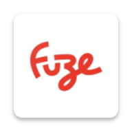

<h1 align="center">
  
</h1>

<p align="center">
  
</p>


## 💻 Project

CSTV is an app that displays CS: GO matches happening across several worldwide tournaments.

# Team

- Here must contain the names of everyone in the team, at the moment that
  project is created
  - Developer: Alexandre Marques

# To Navigation

To navigation, We are using @react-navigation/native V6 as the main library.

## Features

- [ ] List of matches;
- [ ] Match details;

## ✨ Technologies

- [ ] React Native CLI
- [ ] React Navigation V6
- [ ] Expo
- [ ] Expo Font
- [ ] date-fns
- [ ] @ReduxJs/Toolkit
- [ ] Commitizen

## Running the project

### Run

**Install dependencies**

```
yarn
```

**Install IOS Pods**

```
cd ios && pod install
```

**Run IOS**

```
yarn ios
```

**Run Android**

```
yarn android
```

## Running the tests

Use **yarn test** to execute the jest tests.

```cl
yarn test
```

<br />

# Project Structure

```bash
├── assets
│   └── images
├── components
├── navigation
├── screens
├── services
├── store
├── util
├── styles
    └── theme
        └── colors
        └── fonts
        └── spacings
        └── sizes
├── utils
```

<div align="center">
  <small>Developed By Alexandre Marques - 2024/Jan</small>
</div>
